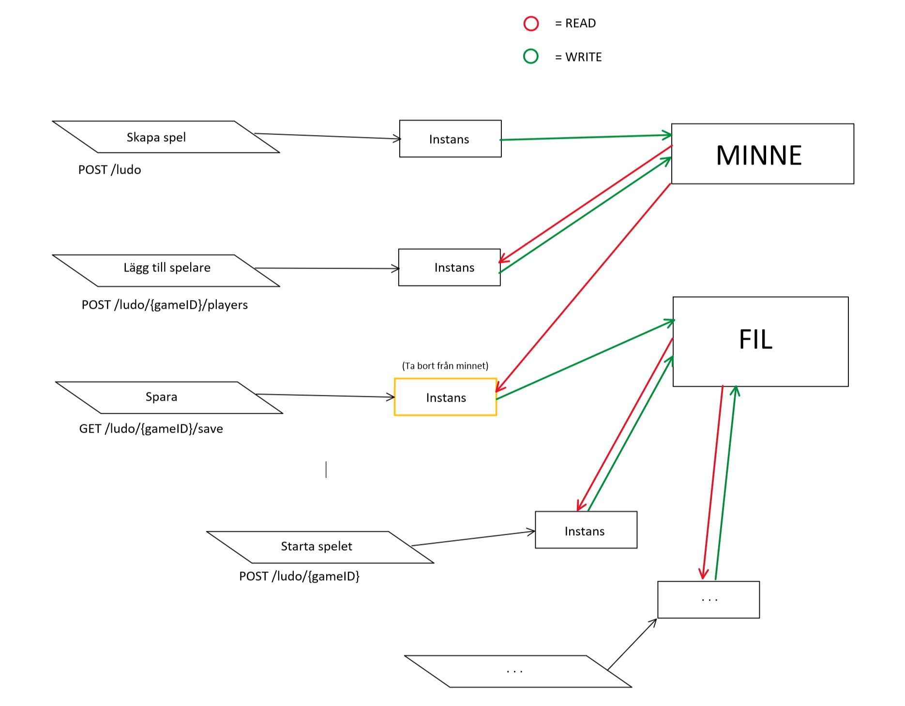

## Instruktioner för att komma igång med ett spel
1. POST: /ludo
	* en sträng skickas med i requestbodyn som namnger spelet, **första spelet får alltid ID 0.**
2. POST: /ludo/{gameID}/players
	* en siffra i intervallet 0-3 (enum) anges i requestbodyn som skapar en spelare med färg.
3. GET: /ludo/{gameID}/save
	* sparar spelet.
4. POST: /ludo/{gameID}
	* starta sparat spel med gameID.
5. GET: /ludo/{gameID}/players/{playerID}/dice
	* slår tärningen för given spelare. Spelare anges inom intervallet 1 - 4.
6. POST: /ludo/{gameID}/players/{playerID}/{pieceID}
	* flyttar pjäsen, anges inom intervallet  1 - 4.

## api-interface

Resources och hur olika metoder påverkar dem

<table>
<thead>
<tr>
<th></th>
<th>GET read</th>
<th>POST create</th>
<th>PUT update</th>
<th>DELETE delete</th>
</tr>
</thead>
<tbody>
<tr>
<td>/ludo</td>
<td>Lista över sparade Ludospel</td>
<td>Skapa ett nytt spel</td>
<td>N/A</td>
<td>N/A</td>
</tr>
<tr>
<td>/ludo/{gameId}</td>
<td>Detaljerad information om spelet, vart alla pjäser står</td>
<td>Starta ett sparat spel</td>
<td>N/A</td>
<td>Ta bort ett sparat spel</td>
</tr>
<tr>
<td>/ludo/{gameId}/save</td>
<td>N/A</td>
<td>Spara ett spel</td>
<td>N/A</td>
<td>N/A</td>
</tr>
<tr>
<td>/ludo/{gameId}/players</td>
<td>N/A</td>
<td>Ny spelare skapas</td>
<td>N/A</td>
<td>N/A</td>
</tr>
<tr>
<td>/ludo/{gameId}/players/{playerId}/dice</td>
<td>Visa vad tärningsslaget visade</td>
<td>N/A</td>
<td>N/A</td>
<td>N/A</td>
</tr>
<tr>
<td>/ludo/{gameId}/players/{playerId}/{piece}</td>
<td>N/A</td>
<td>Välja vilken pjäs man vill flytta</td>
<td>N/A</td>
<td>N/A</td>
</tr>
</tbody>
</table>

## Tester i Postman

Samtliga våra resources och deras metoder enligt tablell ovan har testats i en collection i Postman. Denna collection delas av alla medlemmar i projektgruppen.

https://fantasticappleludo.postman.co/workspaces?type=personal

## CI via Azure DevOps tillagt
## Lagring i databas

Vi skapade en SQL-databas med tabeller och joinade med foreign keys. När databasen skulle användas fick vi dock problem vid inläsning med datatypen Dynamic varför vi valde att spara datan i en Json-fil på användarens skrivbord istället. Databasen liksom metoderna för att spara och hämta speldata från den finns alltjämt kvar så vi har möjlighet att fixa till detta framöver.

*Minnes- och filhantering*

## Förklaringar av speciella begrepp
### correctionFactor

- Varje pjäs har en "lokal" position (antal steg som pjäsen har gått) och en "global" position (vilken ruta på brädan pjäsen står på). De första fyra pjäserna som skapas för en spelare får correctionFactor = 0. Därefter ökas värdet med 10 för varje fjärde pjäs (0, 10, 20, 30). Om vi antar att en pjäs har correctionFactor = 20 och den har gått 16 steg kan vi räkna ut den absoluta positionen (var på brädan den är) genom att ta position + correctionFactor = 20 + 16 = 36. Den befinner sig alltså på ruta 36. Genom att räkna ut den absoluta/globala positionen kan vi jämföra två pjäser med varandra för att avgöra om de står på samma ruta.
Sammanfattat är correctionFactor en "konstant" som adderas med pjäsens lokala position för att få fram dess globala position.

### GamesContainer

- I den här klassen lagras "ofullständiga" Game-instanser tillfälligt i väntan på att skrivas till en fil.

### Drive

- Skriver Game-instanser till en fil i JSON-format. Så fort instansen skrivs till filen, kommer den att tas bort från minnet.

## ToDo's
- [x] Sätta upp och organisera SQL-database in *Gearhost*  
- [x] Upprätta YAML-fil i *VisualStudio* Code alt. *SwaggerHub*
- [x] Upprätta API:et i VisualStudio
- [x] Lägga till CI vi Azure DevOps
- [ ] Refactoring Console till *GameEngine*
- [ ] Göra en Console applikation som kör Fia via Web-API
